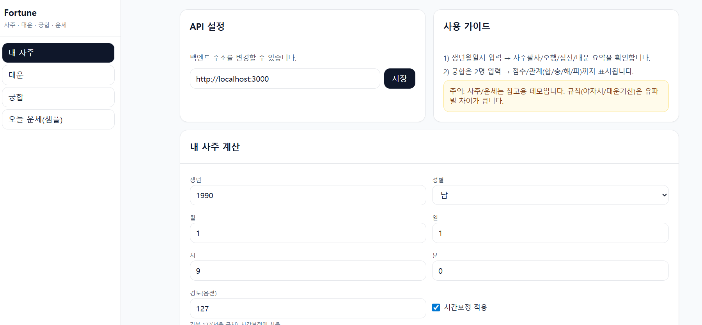
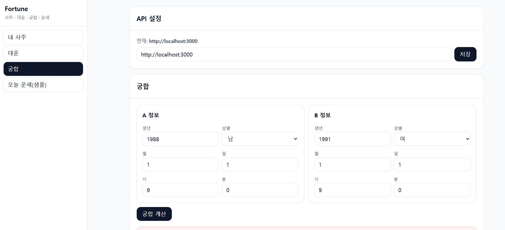

# Fortune Platform

Node(CommonJS) + Open-source manseryeok 기반으로 **사주/대운/궁합/풀이/오늘운세** 가 동작하는 플랫폼입니다.




## 주요 기능
- 🔮 사주팔자(사주 계산, 오행, 십신, 대운)
- 💑 궁합(합/충/해/파 분석 + 점수)
- 📅 오늘의 운세(일진·세운 기반 연애/직업/재물/건강운)
- 👤 회원가입 · 로그인 (JWT 인증)
- 🔔 매일 아침 푸시 알림(Web Push + GitHub Actions 스케줄)
- 🐳 Docker 지원 (개발/배포)

## 테스트 계정
| 이메일 | 비밀번호 |
|--------|---------|
| test1@test.com | 123456 |
| test2@test.com | 123456 |

## 빠른 시작 (로컬 개발)

```bash
# 1. 의존성 설치
pnpm install

# 2-A. 개발 서버 실행 (터미널 두 개)
pnpm -C apps/api dev     # API: http://localhost:3000
pnpm -C apps/web dev     # WEB: http://localhost:5173
```

## Docker로 실행

```bash
# 1. 환경변수 설정
cp .env.example .env
# .env 파일에서 JWT_SECRET 등을 수정

# 2. 빌드 & 실행
docker compose up --build

# WEB: http://localhost:8080
# API: http://localhost:3000
```

## GitHub Actions 설정

### Docker Hub 푸시 (main 브랜치 push 시 자동 실행)
Secrets 등록:
- `DOCKERHUB_USERNAME` - Docker Hub 사용자명
- `DOCKERHUB_TOKEN` - Docker Hub 액세스 토큰

### 매일 아침 운세 푸시 알림 (오전 8시 KST)
Secrets 등록:
- `FORTUNE_API_URL` - 배포된 API URL
- `PUSH_CRON_SECRET` - push 엔드포인트 보안 키 (`.env`의 `PUSH_CRON_SECRET`와 동일)

### VAPID 키 생성 (Web Push)
```bash
npx web-push generate-vapid-keys
# 출력된 키를 .env 또는 Docker 환경변수에 설정
```

## API 엔드포인트

| Method | Path | 설명 |
|--------|------|------|
| POST | `/api/auth/register` | 회원가입 |
| POST | `/api/auth/login` | 로그인 |
| GET | `/api/auth/me` | 내 정보 (JWT 필요) |
| POST | `/api/saju/calc` | 사주/오행/십신/대운 계산 |
| POST | `/api/gunghap` | 궁합 계산 |
| POST | `/api/daily` | 오늘의 운세 (생년월일 선택) |
| GET | `/api/daily/today-ganzhi` | 오늘 일진 정보 |
| GET | `/api/push/vapid-public` | VAPID 공개키 |
| POST | `/api/push/subscribe` | 푸시 알림 구독 (JWT 필요) |
| DELETE | `/api/push/subscribe` | 구독 취소 (JWT 필요) |
| POST | `/api/push/send-daily` | 전체 구독자에게 운세 발송 (cron용) |

## 구성

- `packages/engine` : 만세력 어댑터 + 오행/십신/대운/궁합/일진/오늘운세 엔진
- `apps/api` : Express API 서버 (인증, 푸시 포함)
- `apps/web` : Vite + Tailwind + Offcanvas 웹 앱 (로그인/회원가입 포함)

## 주의/면책

- 사주/운세는 참고용 데모입니다.
- 대운 기산/야자시/시간보정 등은 유파별 차이가 크므로 `packages/engine/src/rulesets/standard.kr.js`에서 서비스 기준을 고정하세요.
- 만세력 라이브러리는 2020~2030년 절기 데이터를 지원합니다. 다른 연도는 대운 시작 나이 계산 없이 대운 순서만 표시됩니다.

